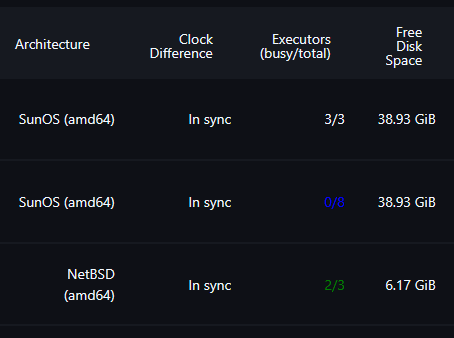

# Executors Monitor Plugin

This is a simple link:http://javadoc.jenkins-ci.org/hudson/node_monitors/NodeMonitor.html[NodeMonitor]
to report the "busy/total/configured" executor counts on the Nodes overview page.

It does not define any thresholds to offline "misbehaving" nodes.

Includes a configurable option for the reported column to be colorized:

* blue for "0 busy",
* green for "busy < total",
* unmodified for "busy == total ( == configured)",
* red for "busy > configured" if that ever occurs (e.g. config change during run-time)

NOTE: The "busy" value represents executors actually processing some work,
the "configured" value is set in the computer (build agent) connfiguration
as the goal for maximum parallelized workload on that agent, and the "total"
value represents the actual momentary maximum (usually same as "configured",
or larger than it if the configuration was reduced but more executors were
running and still remain active -- then the "total" value would shrink over
time until it matches "configured").

## Example of colorized output

* *Colorized "busy/total" example from an earlier version*

